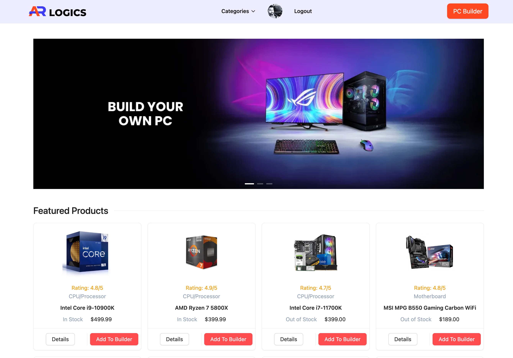

# AR Logics - PC Builder App

Welcome to AR Logics, a web application that allows users to build their own custom PCs using a variety of components. This project is built using Next.js, the Ant Design component library, Next Auth for user authentication, and Redux for state management.

 <!-- Replace 'screenshot.png' with an actual screenshot of your app -->

## Live Demo

Check out the live demo of the AR Logics PC Builder App: [AR Logics - PC Builder App](https://ar-logics-pc-builder-app.vercel.app/)

## Features

1. **User Authentication:** Secure user authentication powered by Next Auth.
2. **Private Routes:** Certain routes are protected to ensure only authenticated users can access them.
3. **Custom PC Building:** Users can select various components to build their own personalized PC setups.
4. **Responsive Design:** The app is designed to work seamlessly across various devices and screen sizes.
5. **Category Archive:** Easily browse and filter components based on different categories.

## Technologies Used

- Next.js 
- Ant Design
- Next Auth
- Redux

---

Enjoy building your dream PC with AR Logics! If you have any questions or suggestions, feel free to contact us.
